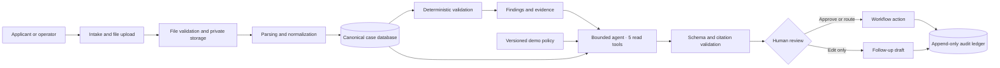

# OpsLedger AI

OpsLedger AI turns a small-business financing package into a structured, evidence-linked review queue. It extracts synthetic PDF and spreadsheet evidence, runs deterministic checks, asks a bounded agent for a cited explanation, and stops at a human decision.

This repository is the working MVP for the Future Caribbean track **Finance, Payments & MSME Capital**. It is a financing-readiness workflow—not a lender, credit model, eligibility engine, or message sender.

**Live demo:** [opsledger-web-production.up.railway.app](https://opsledger-web-production.up.railway.app)<br>
**Public repository:** [github.com/Ternatsu2/opsledger-ai](https://github.com/Ternatsu2/opsledger-ai)

The public showcase is synthetic-data-only and read-only. Reviewers can inspect every case, evidence citation, deterministic finding, model boundary, PDF packet, and audit event. Mutating actions require a server-side reviewer token that is never shipped to the browser.

## What the demo proves

| Case | Deliberate fixture condition | Deterministic route | Human-facing result |
| --- | --- | --- | --- |
| `OPS-2026-0001` · Island Harvest Foods Ltd. | Complete, current, internally consistent package | Ready for Human Review | Cited summary and a guarded approval control |
| `OPS-2026-0002` · Blue Shore Repairs | Ownership declaration missing; revenue evidence 286 days old | Needs Information | Exact missing items and an editable draft that OpsLedger cannot send |
| `OPS-2026-0003` · Caribbean Green Logistics Ltd. | Supporting name mismatch; registration number reused | Manual Investigation | Both conflicts, their evidence, and a resolution-note path |

Every record is synthetic. The public demo tells users not to upload identity, banking, tax, health, or client records.

## System boundary

Deterministic Python services own parsing, normalization, duplicate detection, document recency, arithmetic, workflow transitions, idempotency, and audit history. The language model receives five typed, read-only evidence bundles and may return only a strict Pydantic object. Its route must match the deterministic route. Invalid output gets one repair attempt; there is no open-ended planning loop.



## Run locally

Prerequisites:

- Node.js 24 or newer
- Python 3.12 or newer
- [uv](https://docs.astral.sh/uv/)
- Chrome for the Playwright suite
- optional: an authenticated Codex desktop/CLI installation for local Luna reviews

```bash
npm ci
cd apps/api && uv sync --all-groups && cd ../..
cp .env.example .env
npm run dev
```

Open [http://localhost:3000](http://localhost:3000). API documentation is available at [http://localhost:8000/api/docs](http://localhost:8000/api/docs) while `DEMO_MODE=true`.

The first start applies the versioned database migration and seeds the three cases. Seeding is idempotent. Local development defaults to SQLite and private filesystem storage under `data/`; both are ignored by Git.

### Local Luna mode

The sample environment selects `gpt-5.6-luna` at `xhigh` through the local Codex binary. No model API key is stored in this project. The subprocess runs in an ephemeral read-only directory, gets a strict output schema, has a 120-second timeout, and cannot use project or user execution rules.

```dotenv
MODEL_PROVIDER=codex_luna
CODEX_MODEL=gpt-5.6-luna
CODEX_REASONING_EFFORT=xhigh
MODEL_STRICT=false
```

With `MODEL_STRICT=false`, an unavailable or invalid local model run produces a clearly labelled deterministic fallback. Set it to `true` when verifying the provider integration so failure cannot be mistaken for a model result. The hosted container uses the deterministic provider because the local Codex session is not available inside Railway.

### Container stack

`docker-compose.yml` starts the web application, API, and PostgreSQL with health checks and persistent private volumes.

```bash
POSTGRES_PASSWORD=choose-a-local-password docker compose up --build
```

Docker was not installed on the local build machine, so `docker compose` was not run there. Both application Dockerfiles were built and health-checked by Railway: the web and API containers are serving the live deployment against managed PostgreSQL, and the API uses a persistent private volume for synthetic evidence. See [deployment notes](docs/DEPLOYMENT.md).

## Verify the build

```bash
npm run lint
npm test
npm run test:e2e
npm run build
npm run verify
```

The verification command checks health/readiness, all three expected routes, Case A citations, Case B’s unsent draft, Case C’s exact conflicts, the review-packet PDF, and audit history against a running API. The measured evidence and known caveats are in [docs/TESTING.md](docs/TESTING.md).

Generate the committed synthetic fixture set from source with:

```bash
npm run fixtures
```

## Repository map

- `apps/web` — Next.js 16, TypeScript, accessible reviewer interface
- `apps/api` — FastAPI, Pydantic, SQLAlchemy, Alembic, parsing, rules, agent, exports
- `fixtures` — generated synthetic intake, evidence, and expected-result contracts
- `scripts` — fixture generation and live-system verification
- `docs` — architecture, agent design, safety, test evidence, demo, and submission materials
- `PROGRESS_LOG.md`, `DECISIONS.md`, `ACCESS_STATUS.md` — build continuity and unresolved external access

## Documentation

- [Architecture](docs/ARCHITECTURE.md)
- [Agent design](docs/AGENT_DESIGN.md)
- [Responsible AI statement](docs/RESPONSIBLE_AI.md)
- [Data and fixtures](docs/DATA_AND_FIXTURES.md)
- [Testing evidence](docs/TESTING.md)
- [Security](SECURITY.md)
- [Deployment and rollback](docs/DEPLOYMENT.md)
- [Demo script](docs/DEMO_SCRIPT.md)
- [Submission overview](docs/SUBMISSION_OVERVIEW.md)
- [Final submission package](docs/FINAL_SUBMISSION_PACKAGE.md)
- [Models, tools, and data disclosure](docs/MODELS_TOOLS_DATA.md)

## License

Apache License 2.0. See [LICENSE](LICENSE). Synthetic fixtures were created for this project and contain no former client or real applicant data.
