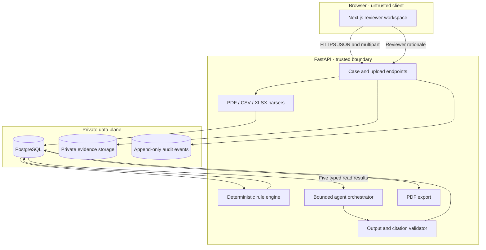

# Architecture

## Deployment shape

OpsLedger uses three independently deployable services:

1. A Next.js web service renders the reviewer workspace and calls the API over HTTPS.
2. A FastAPI service owns every trusted operation: validation, state, model orchestration, audit, and export.
3. PostgreSQL stores canonical records. Evidence files remain in a private filesystem volume for the Railway demonstration or an S3-compatible private bucket when configured.

The browser never receives database credentials, storage credentials, reviewer secrets, or model credentials. `NEXT_PUBLIC_API_URL` is the only public runtime setting.

## Request lifecycle

Case processing is explicit and synchronous for the small buildathon fixture set:

1. The API validates the file extension, declared MIME type, byte signature/container structure, size, and UTF-8 requirements.
2. It sanitizes the filename, hashes the bytes, and stores them under an opaque case/document key.
3. PyMuPDF extracts labelled fields from PDFs. pandas/openpyxl parse bounded CSV/XLSX tables.
4. Pydantic and SQLAlchemy normalize the result into canonical case, document, and extracted-field records with source locators.
5. Deterministic rules calculate the transparent completeness checklist and route the case.
6. The agent reads the case, fields, findings, document metadata, and versioned policy. It cannot fetch arbitrary files or change a case.
7. Pydantic rejects malformed output; grounding checks reject unknown citations, unknown finding IDs, or a route that disagrees with code.
8. A person supplies a rationale before a consequential transition. The database records prior state, new state, actor, and correlation ID.

## Persistence and migration

Alembic migration `20260813_0001` creates the complete schema. It also installs update/delete rejection triggers on `audit_events` for SQLite and PostgreSQL. ORM listeners provide a second application-level guard. Foreign keys are enabled for SQLite connections; PostgreSQL uses native constraints.

The startup path is safe to repeat:

- `alembic upgrade head` applies only missing migrations;
- the seed service exits when a case already exists;
- process and agent-review commands accept an idempotency key;
- the API returns a correlation ID on success and failure.

## Storage

Local mode writes evidence beneath `LOCAL_DATA_DIR/uploads`; this directory is excluded from Git. S3 mode supports a private S3-compatible bucket and requests server-side AES-256 encryption. No public URL is generated. Downloads pass through the API.

The MVP does not scan files for malware, run OCR, accept images, or execute workbook macros. It accepts PDF, UTF-8 CSV, and XLSX only. PDFs are capped at 50 pages, tables at 10,000 rows, and files at 8 MB by default.

## Scaling path

The synchronous processor is intentional for a three-case demo. A controlled pilot should put parsing and model work on a queue, add per-tenant authorization, use private object storage, and run separate worker replicas. The canonical records and idempotency contract already separate request handling from the units that would move to a worker.

PostgreSQL can scale independently from stateless API/web replicas. Document retention, storage region, model routing, and tenant keys remain deployment choices rather than hard-coded product assumptions.

## Failure and rollback

- An unreadable document moves the case to `EXTRACTION_FAILED`; replacement and reprocessing are supported.
- Invalid state transitions are rejected and audited.
- An unavailable local model falls back only when `MODEL_STRICT=false`; the run is labelled `deterministic_fallback` with `PROVIDER_FALLBACK`.
- A bad model response is retried once, then the run fails without applying a human decision.
- Railway rollback uses the previous service deployment. Database migrations are versioned, but destructive downgrade is not part of the public demo runbook.
